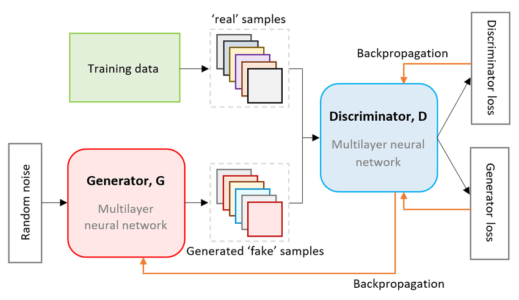

# Generative Advesarial Networks [GANs]

GANs belong to a class of neural networks - Generative Netwokrs

- Mojorly used for enerating realistic images
- Made up of two neural networks which are competing with each other
    - **Generator Network:** Used for generation
    - **Discriminator Network:** Used to determine if the generated image is a real or a fake
- [ Understand GANs better](https://arxiv.org/pdf/1406.2661)

---

## Generator - Discriminator Network

These two neural networks ompete with one another to become more accurate in their predictions

- **Generator Network:** 
    - This network is responsible for generation of realistic data
    - Can generate any sort of data based on training data
    - Learns to generate plausble data
    - Improves the quality of samples during the training process i.e. with time it generates better data

- **Discriminator Network:**
    - A simple classification Model performing binary classification (Real or Fake)
    - Takes input samples from real dataset and from the generator network and figures out which samples are real or fake
    - Learns to distinguish he generator's fake data from real data
    - Forces Generator to improve whenever it correctly distinguishes the generated data from real data

- ***Initialy in the training process its easy for the Discriminator to distinguish between fake and real data but during the training process its ability falls steadily as generator learns to develop better data***

- Architecture of GANs

***The choice of Loss Function is very critical in the GAN model***

---

## Problems with GANs

- ***Vanishing Gradients:*** During training, the gradients from the discriminator can become very small, leading to no effective learning in the generator
    - Can be reduced by using better loss functions
- ***Mode Collapse:*** Generator ends up generating only a certain subset of the input dataset after understaing the discriminator weighs
    - Can be reduced by using improved loss functions, Unrolled GANs
- ***Failure to Converge:*** The training process does not lead to a stable equilibrium, resulting in poor-quality generated data. The generator and discriminator do not reach a point where neither can improve further
    - Can be reduced by adding noise to the discriminator input, penalizing the disciminator weights so as the feedback from discriminator is not random

---

## Applications of GANs

- Generating realistic images
- Text to Image translation
- Photo Inpainting
- Generating 3D objects from 2D images
- Synthetic data generation

---

## Codes

- [Building GAN using Dense Neural Network](gan_denseNN.ipynb)