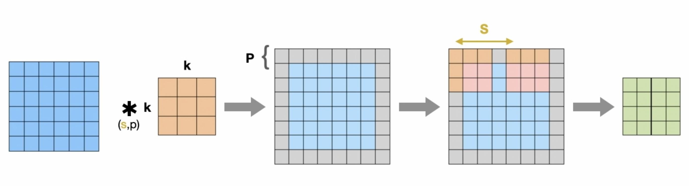
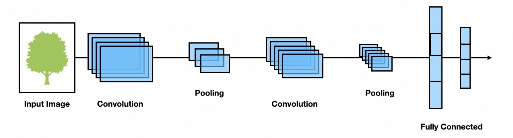
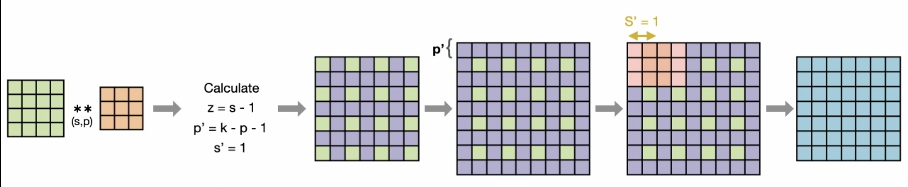

# Convolutional Neural Networks

- NN architecture primarily used for image recognition and processing tasks
- Able to capture location invariant spacial features i.e. CNNs can extract object properties withing an image irrelative of the its location
- Made of 2 layers
  - **Convolutional Layer:** 
    - A kernel [matrix that extracts the features from image] is placed over image and the weights of the kernel are unknown; found during the training process
    - Kernels in different convolutional layers exract different features based on their kernel weighs

    ***Size of output image is o given as:***

$o = \frac{i + 2p - k}{2} + 1$

where o = output image size; p = padding size; i = input image size; k = size of kernel; s = stride

***The output generated here is called a feature map***
  - **Pooling Layer:** 
    - Reduces sample size of input
    - Perfoms some sort of aggregating operations say average pooling, max pooling, min pooling etc.
    - Reduces the number of parameters the network will have to deal with

- Architecture of a CNN

### Types of Convolutional layers

- **Standard Convolutional Layer:** Applies a kernel to extract the features of the image
- **Deconvolutional Layer:** Takes in feature map as the input and preduces the original image i.e. reverses the precess of standard convolutional layer
- **Transposed Convolutional Layer:** Used to perform upsampling of input data i.e. feature map has greater spacial dimensions than that of input feature map

    ***Size of output image is o given as:***
$o = (i - 1) \times s + k - 2p$